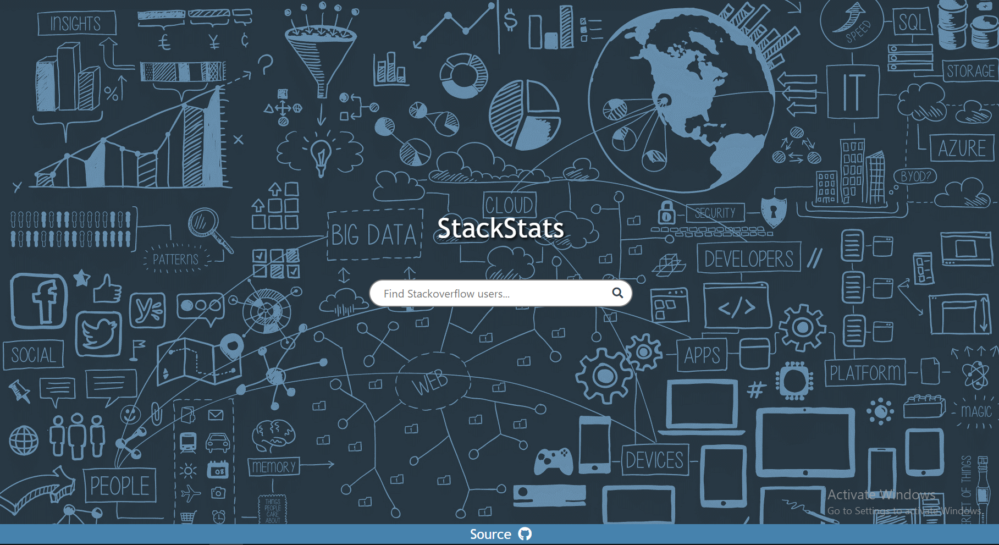
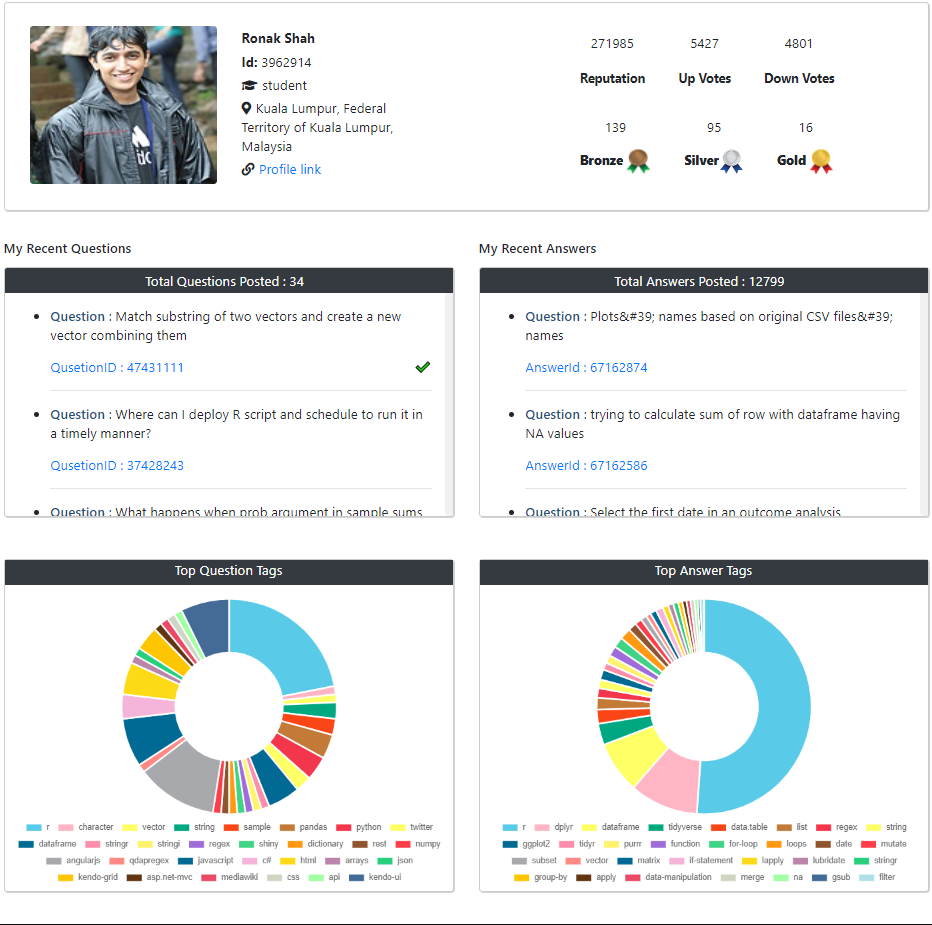

# <font size='6'>StackStats</font>

## Team Members

<a href="https://github.com/Tesla-Atoz">Dinesh Pandikona</a>

<a href="https://github.com/AkhilaAnnireddy">Akhila Annireddy</a>

<a href="https://github.com/chandana-0904">Ravi Chandana Golla</a>

<a href="https://github.com/anushanagula">Nagula Anusha</a>

<a href="https://github.com/SuprajaAlleni">Supraja Alleni</a>

## Project Description

StackStats is a webpage developed using ReactJs and ChartJs which gives analytical report of the stackoverflow users. It provides a profile page which has details regarding the user, recent activity, questions answered, regarding posts and graphs which gives statistical analysis of the tags.

# Available Scripts

In the project directory, you can run:

## Before you begin

`npm install`

This installs all dependencies required by the project. <br />

## For the developers:

`npm run dev`

## To prettify the code:

`npm run pretty`

This allows you to run this repo in the development environment, where you can make changes as well and see it get updated **live**. <br />

## For the end users.

```bash
npm run build
npm start
```

The first command correctly bundles React in production mode and optimizes the build for the best performance. The second command allows you to serve this static file through a node server. <br/>

## Landing page



## Profile page


